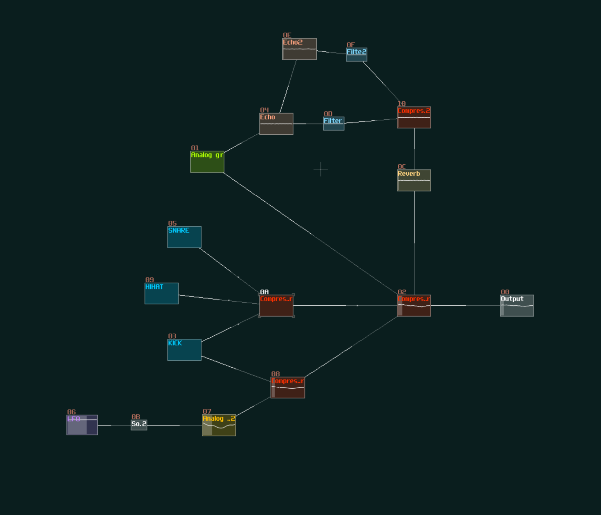
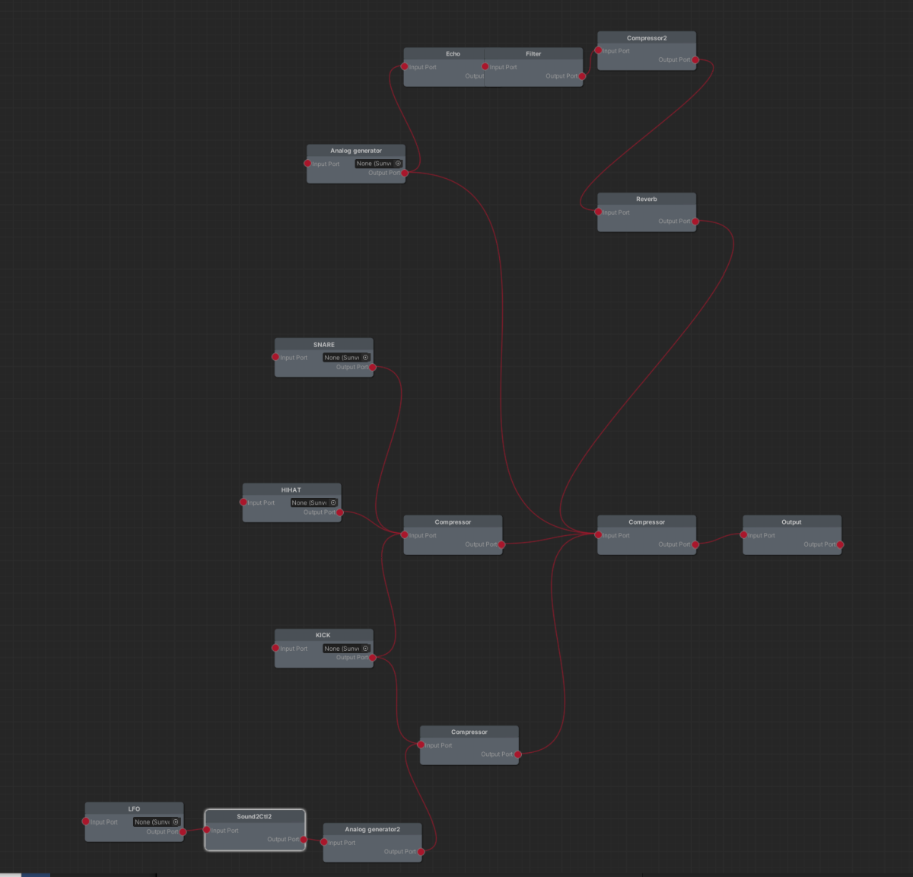

# SunVox-Unity-Node-Editor
SunVox-Unity-Node-Editor is a Unity wrapper for the [SunVox-lib](https://warmplace.ru/soft/sunvox/sunvox_lib.php) audio library 
based on the [SunVox-Unity](https://github.com/AlRado/SunVox-Unity) and [xNode](https://github.com/Siccity/xNode) node editor.

[SunVox](http://www.warmplace.ru/soft/sunvox/) is a small, fast and powerful modular synthesizer with pattern-based sequencer (tracker).

# Current features  
Right now there isn't much possible, you can only open a .sunvox project and connect disconnect modules using the node editor.  

# Planned features  
Open/Close .sunvox project  
Connect/Disconnect modules  
Edit module controllers  
Create/Delete modules  

